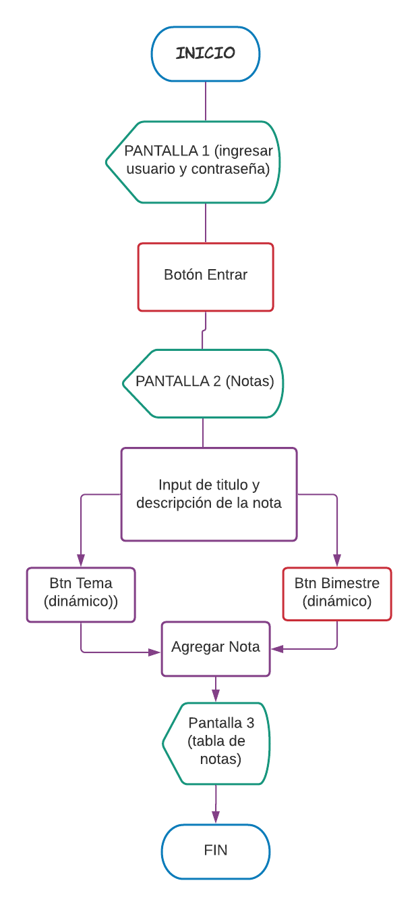
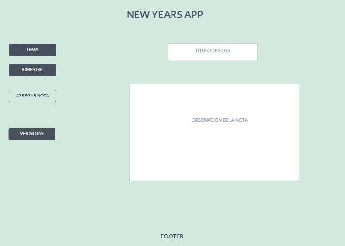
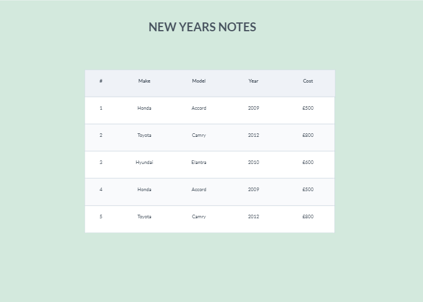

# Technical Challenge

---
Index

    1. Description
    2. Aceptance Criteria
    3. Planning
    4. Flowchart
    5. Sketching out
    6. Final Product
    7. User and Password
---

## Description

Develop yourself a Notes App for yourself to keep in mind your New Year resolutions and goals. The target user is yourself.

---

## Acceptance Criteria

This applications should allow you to enter your goals and objectives with the fields:

* Dropdown Selectable Topics: Personal, Professional, Relationships, Family, Health and Learning
* Title: Input to add a short Title
* Description: Text Area to add the desciption of the goal
* Dropdown with the objective month of achievement.

---

## Planning

---

## Flowchart

---
## SKETCHING OUT

---

## Final Product

---

## User and Password

User: Fercito,

Password: 18